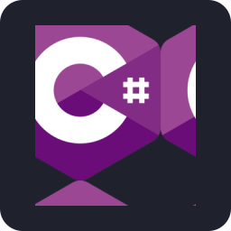

  

<h1 align="center">vlinho-roxo's GitHub</h1>

> _Brazilian Beginner Programmer — Campinas Technical College Unicamp (COTUCA) Student_

- 📖 Still studying...
- ⭐ Highlight: Backend
- 📆 Since February 2025

---

<h2>Knowledge</h2>

<h2>Tools</h2>

